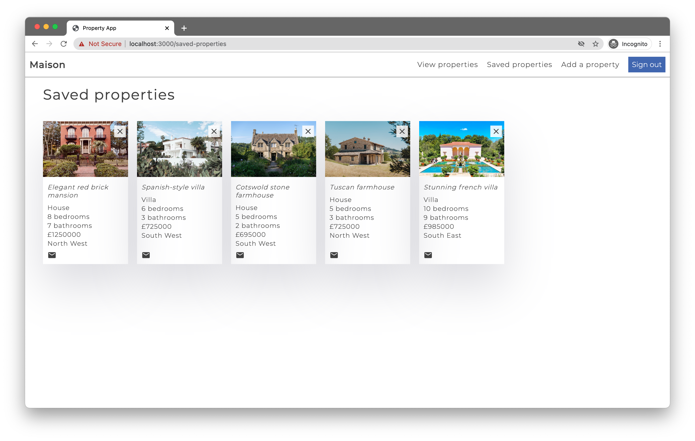

# Property website

A luxury property sales website, built using the latest React technologies. 

Users can view properties for sale, sort, search and filter property results and send an email enquiry to the vendor. Users can also login (using Facebook login API) and save properties to favourites.

As an additional feature, vendors can also add new properties by submitting the 'Add property' form. In the backend, properties are stored in a MongoDB database via an Express API. HTTP requests are made from the frontend using axios. Tested using Jest & React Testing Library, following Test-Driven Development methodology.

I've written a blog post documenting how I built this project - [check it out here](https://jlopenshaw.hashnode.dev/bootcamp-journal-react-property-website-project).

## Table of contents

- [Screenshots](#screenshots)
- [Technologies](#technologies)
- [Languages](#languages)
- [Features](#features)
- [Status](#status)
- [For future development](#features-for-future-development)
- [Inspiration](#inspiration)
- [Contact](#contact)
## Screenshots

## Technologies

- React
- React Hooks, functional components, styled components, React router
- Axios
- React Testing Library and Jest
- Node.js and Node Package Manager
- Git & GitHub
- Postman
## Languages

- JavaScript
## Features

Users can:

- View properties
- Login using their Facebook account via Facebook's login API
- Save properties to favourites
- Remove properties from favourites
- Add a new property to the database/website (functionality for vendors/estate agents)
- Search within property results
- Sort properties by price
- Filter properties by region

## Status

Project is: IN PROGRESS

## Features for future development

- Ability to remove saved projects directly from home page
- Advanced search functionality, including search by region, number of bedrooms, price etc.
- Advanced filter options, including by number of bedrooms, price etc.
- Additional login options, such as by email, by Google etc.

## Inspiration

Project created as part of Manchester Codes Full Stack Software Engineer course.

An extra thank you to [Rita Łyczywek](https://www.flynerd.pl/) for this excellent README template
## Contact

Created by [@jlopenshaw](https://twitter.com/Jlopenshaw) - feel free to contact me about the project
